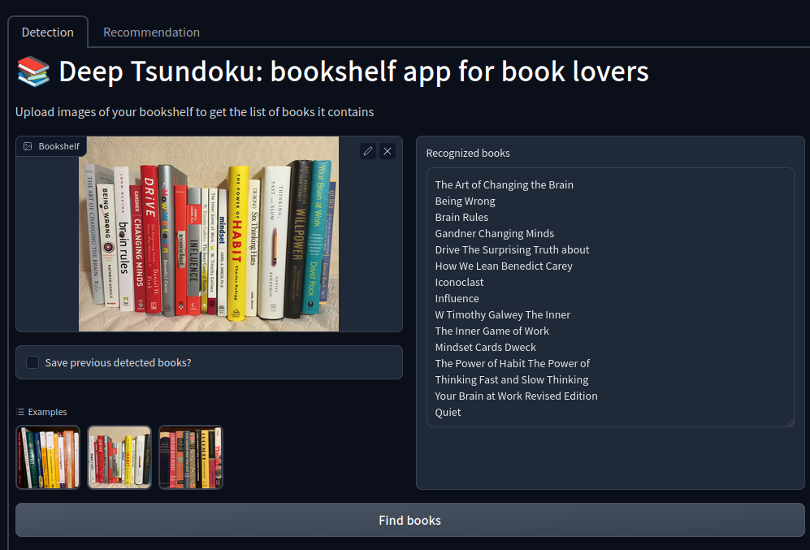

# Deep Tsundoku




## Vision

Deep Tsundoku is a bookshelf app for augmenting the serendipity of physical book browsing with modern information retrieval.

There is a certain joy when fossicking for books, whether in a library, used bookstore, or indie shop, and coming across a literary treasure. However, one usability issue of bookstores is that the number of books might be overwhelming and there is no easy way to "judge a book by its cover" and know if a book is worth your time. Compared to online shopping, we might not remember if we had come across the book before and added it to a wishlist.

Is one of the books I wanted to read on the bookshelf? Will I like this book? Why should I read this certain book? This app aims to answer these questions.

## Installation

```bash
# clone project repository
git clone https://github.com/jay-jojo-cheng/deep-tsundoku.git
cd deep-tsundoku

# install project requirements into your virtual environment
pip install -r requirements.txt --upgrade

# get trained model artifacts (warning takes a few minutes to download)
chmod +x setup.sh
./setup.sh

# launch application
python -m src.app_gradio.app
```

## Contributing
We are very happy to accept contributions and feedback! Contributions can come in all forms, including feature requests, bug reports, bookshelf images that don't work well, etc.

Pull requests are welcome. For major changes, please open an issue first to discuss what you would like to change. Please also make sure to write tests as appropriate.

Don't hesitate to ask for help!

## Roadmap
- (misc) cleanup unused template files from project repo and reorganize directories
- (phase 0) retrain title-author model on higher resolution
- (phase 0) batch predictions from set of segmented images at inference time
- (phase 0) adapt [synthdog](https://github.com/clovaai/donut/tree/master/synthdog) for creating synthetic bookspine images
- (phase 1) introduce cutoff for recommend/don't recommend instead of just ranking
- (phase 1) try LinkedIn's [DeText](https://github.com/linkedin/detext) framework for language-based ranking to help with books not in the product-product graph
- (phase 2) first version of explanation

## License
[GPL-3.0](https://choosealicense.com/licenses/gpl-3.0/)

## Credits
- Lakshya Khatri's [work](https://github.com/LakshyaKhatri/Bookshelf-Reader-API) on spine detection was helpful in writing our segmenter
- Clova AI's [donut](https://github.com/clovaai/donut) (document understanding transformer) model serves as the architecture that we fine-tune for book detection
- Nils Reimers and Iryna Gurevych's [Sentence-BERT](https://www.sbert.net/) is used for our title string vector search
- Eugene Yan's recommender system [blogposts](https://eugeneyan.com/writing/recommender-systems-graph-and-nlp-pytorch/) and his other [writings](https://eugeneyan.com/writing/system-design-for-discovery/) on recsys generally were helpful in building the first version of our recommendation system
